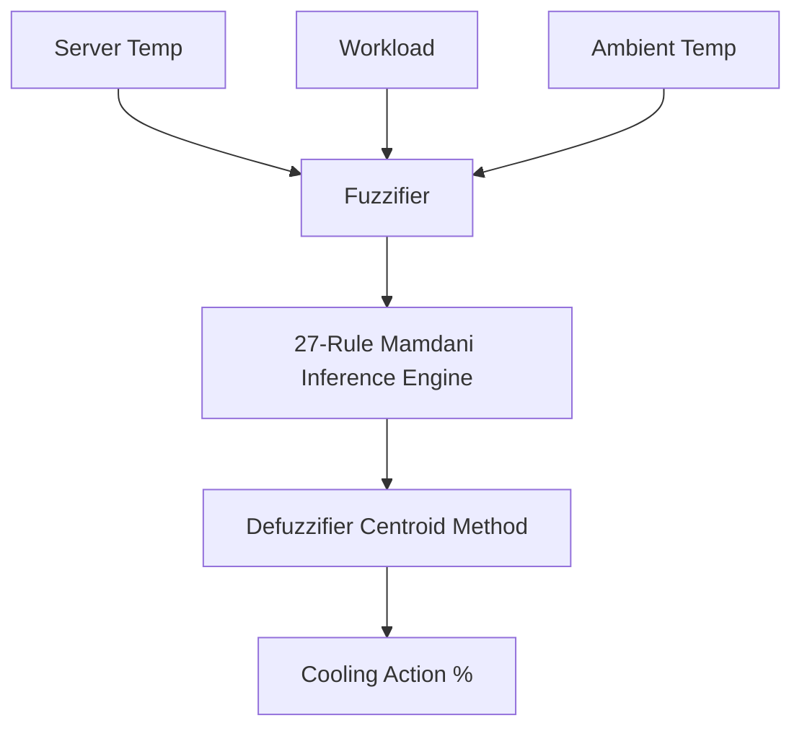

# Data Center Fuzzy Cooling Simulation & Control Twin

This repository implements a **Mamdani Fuzzy Logic Controller (FLC)** designed to regulate server temperatures inside a simulated data center. 

The project has been modularly split into two layers:
1. **Core Logic Module (`fuzzy_engine.py`):** Contains the fuzzy sets, interpolation, rule activation logic, and defuzzification calculations. It can be run directly as a CLI utility or imported into other apps.
2. **Dashboard UI (`data_center.py`):** Streamlit dashboard rendered via high-performance Apache ECharts canvas modules that imports the engine for its control loops.

---

## 🚀 How to Run

### Option A: The Streamlit Web Dashboard (GUI)
Provides visual charts, physical closed-loop simulations, and step-by-step graphical inspect curves:
```powershell
streamlit run data_center.py
```

### Option B: The Fuzzy Engine CLI Utility (Terminal)
Evaluates a single state state logic query. It prompts you for input variables and outputs fuzzification details, active rules, and cooling outcome:
```powershell
python fuzzy_engine.py
```

---

## 🌡️ 1. Why the Server Temperature Behaves as It Does

When running the simulation, you will observe the server temperature rapidly trending toward and stabilizing at a specific range (typically between **35°C to 45°C** depending on workload). This is a result of a **negative feedback loop** governed by the physical environmental equations and the fuzzy controller.

### The Physics Model ("The Plant")
At each step $t$, the next server temperature $T_{t+1}$ is calculated as:
$$T_{t+1} = T_t + Q_{\text{gen}} + Q_{\text{amb}} - Q_{\text{cool}} + \text{Noise}_t$$

Where:
1. **$Q_{\text{gen}}$ (CPU Heat Generation):** Heat generated proportional to CPU workload $W_t \in [0, 100]$:
   $$Q_{\text{gen}} = W_t \times 0.16$$
2. **$Q_{\text{amb}}$ (Ambient Heat Exchange):** Passive thermal exchange with ambient room air temperature $T_{\text{amb}, t}$:
   $$Q_{\text{amb}} = (T_{\text{amb}, t} - T_t) \times 0.18$$
3. **$Q_{\text{cool}}$ (Active Heat Dissipation):** Heat removed from the server chassis by the cooling fans:
   $$Q_{\text{cool}} = C_{t - D} \times 0.12$$
   where $D$ is the configured **Heat Dissipation Steps** (the phase delay of the cooling system).
4. **$\text{Noise}_t$ (Thermal Spikes & Environmental Noise):** Random thermal variance ($\pm0.4^\circ\text{C}$) and periodic load spikes ($+1.8^\circ\text{C}$ to $+3.2^\circ\text{C}$) representing localized hardware bursts.

### Sealed Data Center Room Dynamics
In a real sealed containment room, the ambient air temperature is not a static curve; it is directly coupled with the server's rejected exhaust heat and the facility's air conditioning system (CRAC):
$$T_{\text{amb}, t+1} = T_{\text{amb}, t} + Q_{\text{dump}} - Q_{\text{CRAC}} + \text{Noise}_{\text{air}}$$
- **$Q_{\text{dump}}$ (Server Heat Rejection):** Server exhaust fans blow hot air into the room: $Q_{\text{dump}} = C_{t - D} \times 0.05$.
- **$Q_{\text{CRAC}}$ (Facility Heat Extraction):** The room's CRAC system extracts heat to pull the ambient temperature down to the setpoint: $Q_{\text{CRAC}} = 0.38 \times (T_{\text{amb}, t} - T_{\text{CRAC}})$.
- **$\text{Noise}_{\text{air}}$ (Air Mixing Noise):** Localized air currents and mixing turbulence ($\pm0.15^\circ\text{C}$).

---

## ⚙️ 2. Core Simulation Parameters Explained

The simulation behavior is highly configurable using three primary environmental parameters:

### A. CRAC Target Temp Setpoint ($T_{\text{CRAC}}$)
The target temperature set on the computer room air conditioners (CRAC). The room ambient temperature rises dynamically above this setpoint based on server heat output, balancing server heat rejection with CRAC cooling capacity. A lower setpoint keeps the room cooler, increasing the chassis-to-air temperature gradient and making cooling more efficient.

### B. Heat Dissipation Steps ($D$)
Models the **thermal inertia and lag** of the cooling infrastructure (fan ramp-up, air circulation). The calculated cooling command is stored in a queue and only applied as heat dissipation $D$ steps later. A higher lag creates visual oscillations (overshoots and undershoots) as the controller tries to regulate based on delayed thermal feedback.

### C. Workload Volatility (Stochasticity)
Controls the severity of workload changes. A higher volatility increases both the probability of sudden batch load shifts (representing massive server job starts/terminations) and the range of step-by-step workload fluctuations, yielding dynamic and visually interesting telemetry lines.

---

## 🧠 3. Fuzzy Control System Specification

The system regulates a single output variable based on three distinct input metrics.



### A. Input Variables & Membership Functions

#### 1. Server Temperature ($T \in [10^\circ\text{C}, 90^\circ\text{C}]$)
- **Low:** Left-shoulder trapezoid, $\mu_{\text{Low}}(T) = [10, 25, 40]$
- **Medium:** Triangular, $\mu_{\text{Medium}}(T) = [25, 45, 65]$
- **High:** Right-shoulder trapezoid, $\mu_{\text{High}}(T) = [50, 70, 90]$

#### 2. Server Workload ($W \in [0\%, 100\%]$)
- **Light:** Left-shoulder trapezoid, $\mu_{\text{Light}}(W) = [0, 25, 50]$
- **Moderate:** Triangular, $\mu_{\text{Moderate}}(W) = [25, 50, 75]$
- **Heavy:** Right-shoulder trapezoid, $\mu_{\text{Heavy}}(W) = [50, 75, 100]$

#### 3. Ambient Environment Temperature ($T_{\text{amb}} \in [10^\circ\text{C}, 45^\circ\text{C}]$)
- **Cool:** Left-shoulder trapezoid, $\mu_{\text{Cool}}(T_{\text{amb}}) = [10, 18, 25]$
- **Normal:** Triangular, $\mu_{\text{Normal}}(T_{\text{amb}}) = [18, 25, 32]$
- **Hot:** Right-shoulder trapezoid, $\mu_{\text{Hot}}(T_{\text{amb}}) = [25, 32, 45]$

---

### B. Output Variable & Membership Functions

#### Cooling Output Power ($C \in [0\%, 100\%]$)
- **Low:** Left-shoulder trapezoid, $\mu_{\text{Low}}(C) = [0, 15, 30]$
- **Medium:** Triangular, $\mu_{\text{Medium}}(C) = [20, 40, 60]$
- **High:** Triangular, $\mu_{\text{High}}(C) = [50, 67.5, 85]$
- **Maximum:** Right-shoulder trapezoid, $\mu_{\text{Maximum}}(C) = [75, 85, 100]$

---

## 📜 3. The 27-Rule Mamdani Inference Matrix

The fuzzy control rules match the exact domain-specific settings of [FuzzyLogicRules.md](file:///C:/Users/User/Documents/3rd%20year/CI/data_center/FuzzyLogicRules.md):

### Complete Rule Matrix

The 27 rules are organized below as three $3 \times 3$ cross-tabulation matrices:

#### 1. When Ambient Temperature is **Cool**

| Server Temp (IF) \ Workload (IF) | Light | Moderate | Heavy |
| :--- | :---: | :---: | :---: |
| **Low** | **Low** | **Low** | **Medium** |
| **Medium** | **Low** | **Medium** | **Medium** |
| **High** | **High** | **High** | **Maximum** |

#### 2. When Ambient Temperature is **Normal**

| Server Temp (IF) \ Workload (IF) | Light | Moderate | Heavy |
| :--- | :---: | :---: | :---: |
| **Low** | **Low** | **Low** | **Medium** |
| **Medium** | **Medium** | **Medium** | **High** |
| **High** | **High** | **High** | **Maximum** |

#### 3. When Ambient Temperature is **Hot**

| Server Temp (IF) \ Workload (IF) | Light | Moderate | Heavy |
| :--- | :---: | :---: | :---: |
| **Low** | **Low** | **Medium** | **High** |
| **Medium** | **Medium** | **High** | **High** |
| **High** | **High** | **Maximum** | **Maximum** |

---

## 🎯 4. Inference & Defuzzification

1. **Rule Aggregation (Mamdani Min-Clip):**
   For each rule $i$, the fired strength $\alpha_i$ is computed using the intersection (AND) operator:
   $$\alpha_i = \min\left(\mu_{\text{Temp}_i}(T), \mu_{\text{Workload}_i}(W), \mu_{\text{Ambient}_i}(T_{\text{amb}})\right)$$
   The clipped output fuzzy set for each consequence category $L \in \{\text{Low}, \text{Medium}, \text{High}, \text{Maximum}\}$ is aggregated using the union (OR) max operator:
   $$\mu_{\text{Agg}, L}(C) = \max_{i \in \text{Rules yielding } L} (\alpha_i)$$

2. **Defuzzification (Centroid Method):**
   The crisp output value $C^*$ is computed using the Center of Gravity (Centroid) of the aggregated fuzzy sets:
   $$C^* = \frac{\sum (x_k \times \mu_{\text{Agg}}(x_k))}{\sum \mu_{\text{Agg}}(x_k)}$$
   where $x_k$ represents the discrete sampling coordinates (centroids) of each output membership set.
